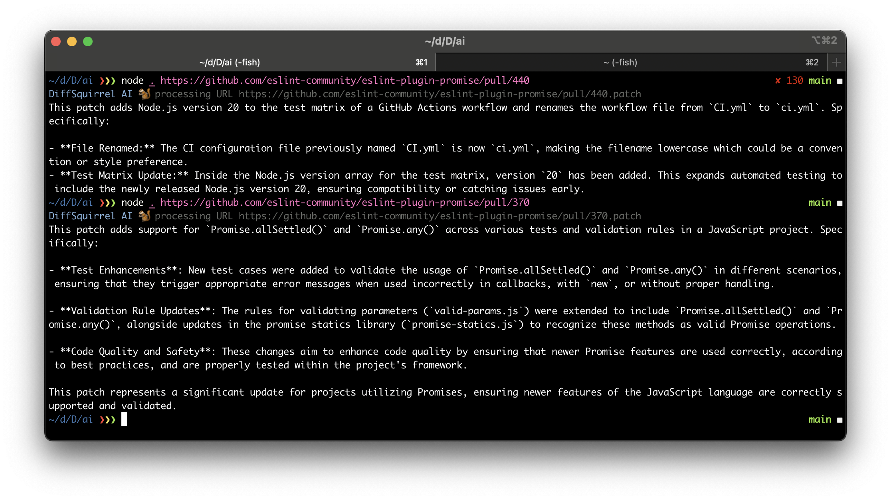

# ai

AI-based tool for summarising git diffs

## Setup

First you need to get and set the `OPENAI_API_KEY` environment variable.

You can sign up here: https://platform.openai.com/

Then you need to run `npm install`

## Usage

Pass in the location of a local patch file or link directly to a pull request to retrieve a summary.

```
node index.mjs https://github.com/eslint-community/eslint-plugin-promise/pull/370
node index.mjs ./patches/01-basic-import-export.patch
```

## Generating Patches

```shell
git format-patch <diff-branch> <folder> -o patches

# for example
git format-patch HEAD~1 example -o patches
```

## Example


